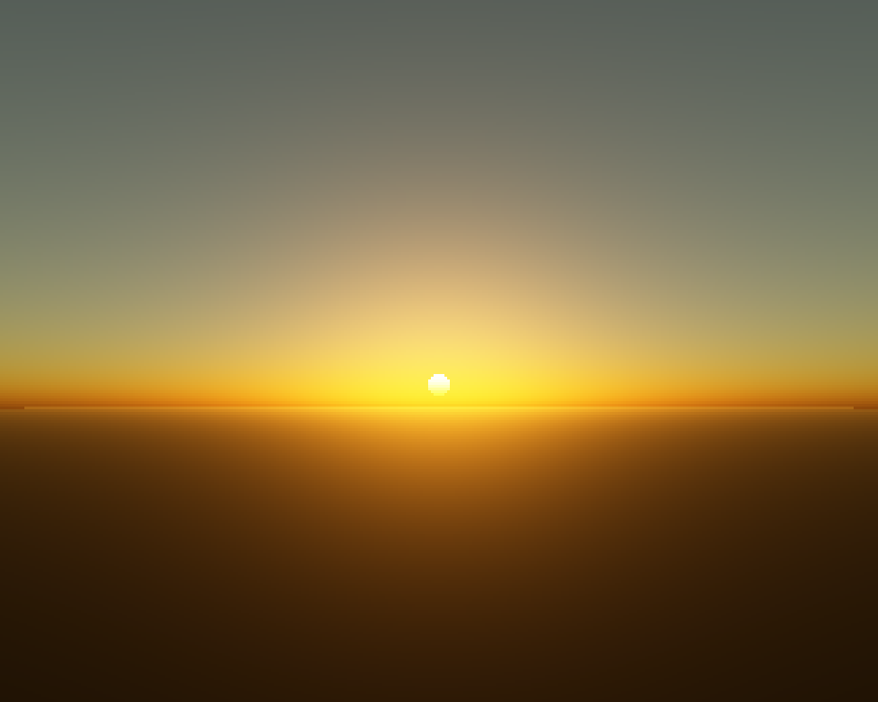

# Skylight

[](https://github.com/sponsors/makarov-mm)
[](LICENSE)


[](https://www.linkedin.com/in/makarov-mm/)
[](https://www.threads.net/@m.m.makarov)
[](https://www.instagram.com/m.m.makarov/)

A physically based sky: Rayleigh + Mie single scattering, raymarched around a
spherical planet. One altitude slider takes you from a sunset on the ground to
the blue rim of the planet seen from orbit — same equations, no special cases,
which is rather the point.



## Physics

For every pixel a view ray is marched through the atmosphere shell
(ground 6360 km, top 6420 km). At each sample the Rayleigh and Mie densities
`exp(-h/H_R)`, `exp(-h/H_M)` (H_R = 8 km, H_M = 1.2 km) accumulate optical
depth, and a secondary march toward the sun gives the transmittance of the
incoming light. In-scattered radiance sums

```
T_view · T_sun · (β_R ρ_R P_R(θ) + β_M ρ_M P_M(θ)) ds
```

with the Rayleigh phase `3/(16π)(1+cos²θ)` and a Henyey-Greenstein-type Mie
phase (adjustable g). Sea-level β_R = (5.8, 13.5, 33.1)·10⁻⁶ m⁻¹ — the
wavelength dependence that makes the day sky blue and the sunset red is in
those three numbers, nothing is painted by hand. Ground is diffuse, lit by the
sun's attenuated transmittance; the sun disk is drawn through the view
transmittance.

Verified numerically: midday zenith comes out blue-dominant, a sunset horizon
comes out gold/orange while the high sky dims, and from 20000 km the lit
planet disk shows a bluish limb.

## Controls

Altitude (log slider, 0.1 km – 40000 km), sun elevation (-15° … 90°), look
pitch + LMB drag, Mie g, turbidity (haze), exposure, quality (samples per
ray), render resolution. The image re-renders only when a parameter changes.

## Build

```
cmake -B build -DCMAKE_BUILD_TYPE=Release
cmake --build build -j
```

Requires Qt6. C++17, Qt6 Widgets only, multithreaded raymarcher.

`DUMP_FRAMES=N` + `ATMO_SUN` / `ATMO_ALT` / `ATMO_PITCH` env vars render a
configuration headlessly and save `dump.png`.

## License

MIT License

Copyright (c) 2026 Mykhailo Makarov

Permission is hereby granted, free of charge, to any person obtaining a copy
of this software and associated documentation files (the "Software"), to deal
in the Software without restriction, including without limitation the rights
to use, copy, modify, merge, publish, distribute, sublicense, and/or sell
copies of the Software, and to permit persons to whom the Software is
furnished to do so, subject to the following conditions:

The above copyright notice and this permission notice shall be included in all
copies or substantial portions of the Software.

THE SOFTWARE IS PROVIDED "AS IS", WITHOUT WARRANTY OF ANY KIND, EXPRESS OR
IMPLIED, INCLUDING BUT NOT LIMITED TO THE WARRANTIES OF MERCHANTABILITY,
FITNESS FOR A PARTICULAR PURPOSE AND NONINFRINGEMENT. IN NO EVENT SHALL THE
AUTHORS OR COPYRIGHT HOLDERS BE LIABLE FOR ANY CLAIM, DAMAGES OR OTHER
LIABILITY, WHETHER IN AN ACTION OF CONTRACT, TORT OR OTHERWISE, ARISING FROM,
OUT OF OR IN CONNECTION WITH THE SOFTWARE OR THE USE OR OTHER DEALINGS IN THE
SOFTWARE.

## License

MIT License

Copyright (c) 2026 Mykhailo Makarov

Permission is hereby granted, free of charge, to any person obtaining a copy
of this software and associated documentation files (the "Software"), to deal
in the Software without restriction, including without limitation the rights
to use, copy, modify, merge, publish, distribute, sublicense, and/or sell
copies of the Software, and to permit persons to whom the Software is
furnished to do so, subject to the following conditions:

The above copyright notice and this permission notice shall be included in all
copies or substantial portions of the Software.

THE SOFTWARE IS PROVIDED "AS IS", WITHOUT WARRANTY OF ANY KIND, EXPRESS OR
IMPLIED, INCLUDING BUT NOT LIMITED TO THE WARRANTIES OF MERCHANTABILITY,
FITNESS FOR A PARTICULAR PURPOSE AND NONINFRINGEMENT. IN NO EVENT SHALL THE
AUTHORS OR COPYRIGHT HOLDERS BE LIABLE FOR ANY CLAIM, DAMAGES OR OTHER
LIABILITY, WHETHER IN AN ACTION OF CONTRACT, TORT OR OTHERWISE, ARISING FROM,
OUT OF OR IN CONNECTION WITH THE SOFTWARE OR THE USE OR OTHER DEALINGS IN THE
SOFTWARE.

## Support

If you found this project interesting or useful, you can support my work:

[](https://github.com/sponsors/makarov-mm)
